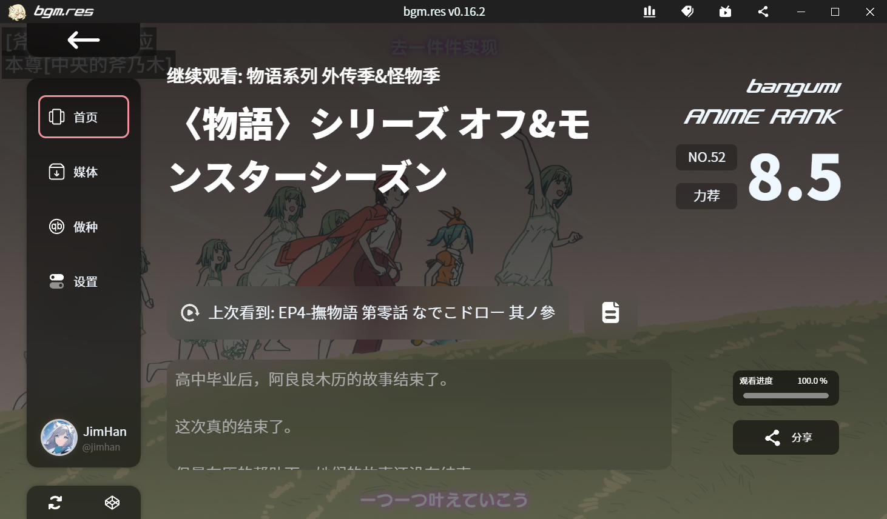
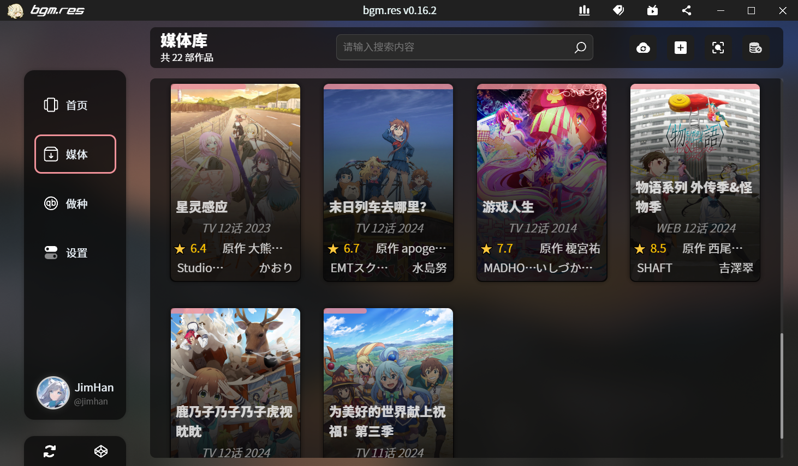
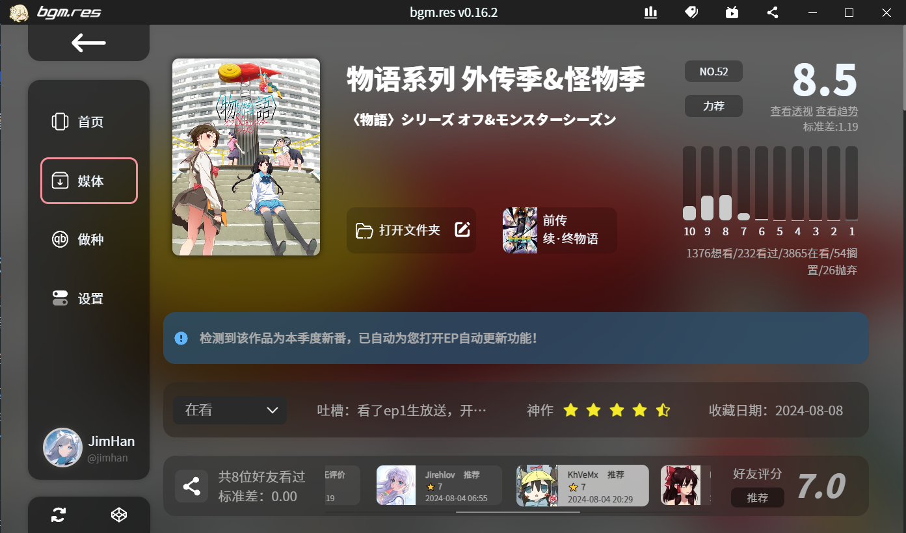
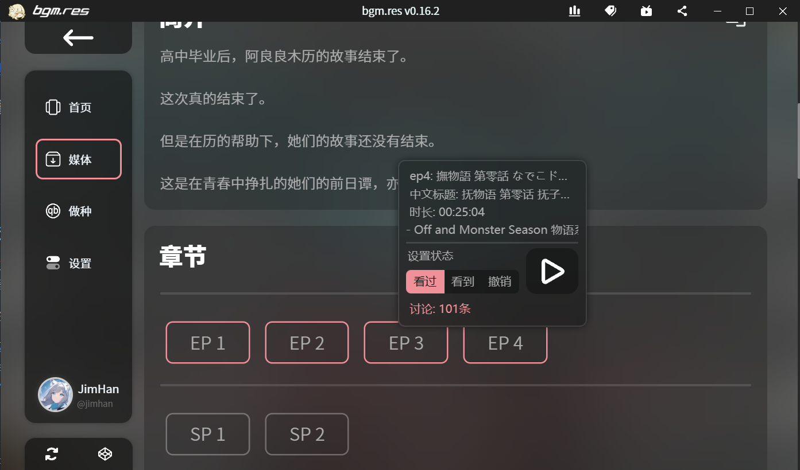
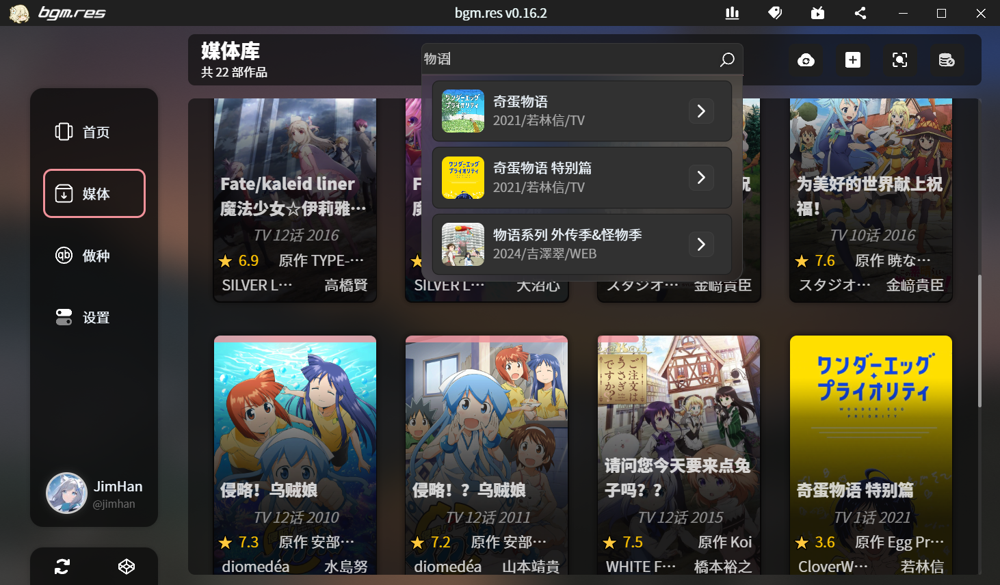
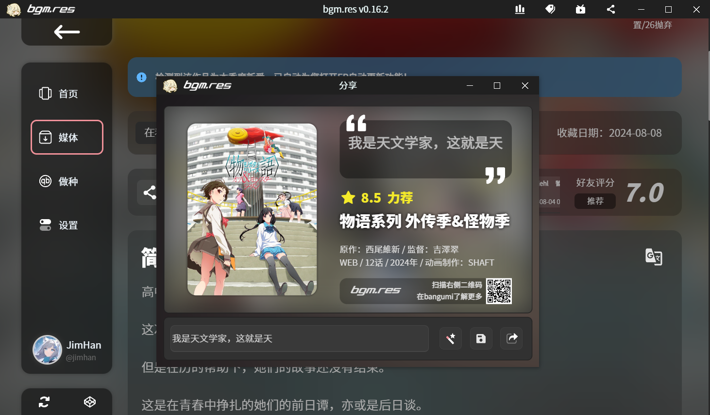

<h1 align="center"> bgm.Res </h1>
<h3 align="center"> Light, Functional and Modern Local Anime Manager Based on bgm.tv</h3>
 

语言/Language:
[中文](https://github.com/JimHans/bgm.res/blob/master/README.md) | [English](https://github.com/JimHans/bgm.res/blob/master/README_EN.md)

---

### 基于`Electron`框架，使用[Bangumi番组计划](https://bgm.tv/)api作为作品识别接口的轻量、多功能、现代化的桌面本地动画番剧资源管理客户端
---
该客户端适用于以下场景：
- ✅ 使用计算机硬盘存储与播放本地动画资源的用户
- ✅ 拥有适中的动画资源库规模（一般在2000部以内）
- ✅ 使用NAS存储动画资源，但希望通过SMB、WebDAV等目录共享方式播放的用户
- ✅ 不希望花费时间调整emby/jellyfin或对其媒体播放器效果不满意的用户
- ✅ 希望接入bangumi番组计划数据库来获取本地动画信息的用户
- ✅ 期望在播放动画时链接bangumi实现进度同步点格子功能的用户

暂不适用于以下情景：
- ❌ 已经使用emby等媒体库管理软件管理媒体，且媒体库未通过目录共享挂载在计算机上
- ❌ 拥有太多媒体资源（2000+部），bgm.res暂时可能过于卡顿
- ❌ 在动画资源外，还需要管理游戏、漫画、小说等资源库的用户。bgm.res在当前（至少在1.5版本以内）没有对它们的识别支持。
- ---
### 本软件仍处于测试阶段，功能仍旧不稳定且版本更迭频繁，请酌情试用，感谢。正式版本发布时间待定

## 🎰 支持功能：
**本地番剧管理**
- [x] 添加本地作品库文件夹，自动扫描作品
- [x] 高性能媒体库支持，支持最多2000部作品
- [x] 内置基础刮削器，支持自动作品匹配
- [x] 支持动态更新媒体库
- [x] 新番自动识别更新章节
- [x] 自定义刮削正则匹配表达式
- [x] 自动获取匹配bangumi番组计划数据库作品信息
- [x] 作品库作品全局搜索
- [x] 手动作品添加，添加作品库外作品
- [x] 手动作品编辑，手动纠正作品信息，作品章节，添加SP章节等
- [x] 自动同步观看进度至bangumi
- [x] 查看作品简介，评分，透视，制作信息，目录，相关作品，标签与角色信息等
- [x] 查看章节信息与讨论
- [x] 查看bangumi好友的作品评价
- [x] 自定义作品封面与信息
- [x] 支持显示作品科学排名信息
- [x] 作品评分分段显示与标准差计算
- [x] 自动或手动记录作品观看进度
- [x] 作品简介翻译
- [x] bangumi账户活动主页
- [x] 支持特典扫描
- [x] 支持海报生成分享
- [x] 支持媒体库自动递归扫描
- [x] 支持新番自动扫描更新EP
- [ ] *支持作品合集创建*
- [ ] *支持自定义排序*
- [ ] *支持媒体库排版样式更换*

**最近观看汇总**
- [x] 首页展示最近观看作品信息
- [x] 支持继续播放本话或播放下一话
- [x] 支持离线存储部分最近观看数据
- [x] 支持云端同步最近观看数据

**做种管理集合**
- [x] 合入qBittorrnet Web UI展示位，支持链接qBittorrnet管理做种
- [x] 自动检测Web UI联通情况
- [ ] *基于Web API的全新管理UI*
- [ ] *Web UI支持自动登录*

**本地番剧观看**
- [x] 内置mpv播放引擎，支持单独更新播放器，mpv默认内置Anime4K。
- [x] 支持自定义mpv配置文件
- [ ] *支持调用外部播放器播放*

**界面**
- [x] WinUI 3风格设置界面
- [x] 自定义背景图
- [x] 首页支持显示自定义背景图
- [x] 自定义主题色
- [x] 全局高斯模糊效果，非线性动画
- [x] 首页实时观看进度背景
- [x] OOBE开箱指南
- [x] 全局Mica/Acrylic效果

## 📥下载：
本项目默认提供Windows x64 可执行安装程序，未来将增加Linux版本二进制执行程序与Windows arm64 可执行安装程序打包。Mac OS用户请自行编译安装，由于手头没有林檎电脑（黑果也没有），因此不保证本项目程序在Mac OS的运行表现。

稳定版：[Release Download](https://github.com/JimHans/bgm.res/releases/latest)

测试版：[PreRelease Download](https://github.com/JimHans/bgm.res/releases)

## 💻软件截图：
<table>
  <tr>
    <td></td>
    <td></td>
  </tr>
  <tr>
    <td></td>
    <td></td>
  </tr>
  <tr>
    <td></td>
    <td></td>
  </tr>
</table>

## 📝附录：

### 📚安装方法、使用指南、FAQ、📌注意事项请见项目[Wiki页面](https://github.com/JimHans/bgm.res/wiki)

*✨如果您有对本项目的更多使用或者功能方面的问题与建议，以及对本项目有更好的看法与构思，欢迎在本项目Issue下留言，或者为本项目Pull Requests！*

*同时也可以在bangumi私信作者[JimHan](https://bgm.tv/user/jimhan)*

*编译注意事项：本项目使用的内置播放器mpv与视频截图组件ffmpeg在编译时需要另行添加后才可以正常使用。请将mpv portable文件夹改名为mpv，然后将ffmpeg.exe放在mpv文件夹下，将mpv文件夹置于本项目根目录中，即可正常使用与打包。*

## 🧡感谢：

本项目离不开以下项目支持：

[mpv / ©mpv-player / GPL-2.0, LGPL-2.1 licenses][1]  

[sciRanking_simple / ©NeutrinoLiu / GPL-2.0 license][2]

[electron-store  / ©sindresorhus / MIT license ][4]  

[ffmpeg  / ©ffmpeg / GPL-2.0, LGPL-2.1 licenses ][5]  

[bangumi-api接口][3]  

This Program is open sourced under the GPL v3.0 license.

本程序基于 GPL v3.0 License 开源，不得用于商业用途

[1]: https://github.com/mpv-player/mpv
[2]: https://github.com/NeutrinoLiu/sciRanking_simple/
[3]: https://github.com/bangumi/api
[4]: https://github.com/sindresorhus/electron-store
[5]: https://github.com/FFmpeg/FFmpeg